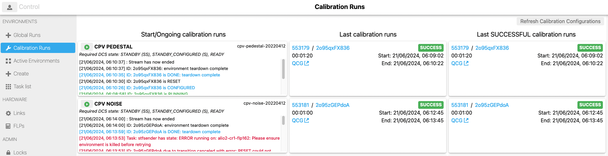

# Calibration Page

ALICE detectors need to have successfully run certain configurations before start data taking during Stable Beams. These are so called "Calibration Runs" which contain a specific configuration. Thus, to reduce the error risk of selecting a wrong configuration or inputing wrong parameters, AliECS GUI provides a dedicated Calibration Page. 

This page allows admins to define in a JSON object what configurations need to be run by each detector and the GUI builds the page dynamically based on the configuration retrieved from the used KV Store.

### Configuration of Calibration Page

Key: `o2/runtime/COG/calibration-mappings`

The configuration is stored under the above key and expects the following format:

```json
{
  "<detector_name>": [
    {
      "runType": "<run_type_name>", // name of the run type desired to start. This is then used when fetching the run from Bookkeeping to display to the user information about the previous runs.
      "configuration": "<configuration_key>", // configuration key that is already stored in the KV Store which contains the entire configuration set of parameters that is to be sent to ALiECS.
      "label": "<label_name>", // readable and user friendly label that is to be displayed in the GUI
      "description": "<description>" // Field that allows for a longer string with the goal of informing the shifter of the conditions that need to be met before starting such a run.
    }
  ]
}
```

As per the example above, each detector expects an array of configurations, allowing for one or more runs to be defined as calibration runs. 

## Features of the Calibration Page

### Refresh Calibration Configuration
If the admins modify the configuration based on which the page should be built, the button `Refresh Calibration Configuration` should be pressed to fetch the new configuration. 

### Action Panel
The action panel allows the users to:
- start a calibration run via 1-click button.
- following the progress of the started calibration run.
  
#### AutoTransitioning Environments
The GUI makes use of the auto-transitioning environments from ECS, meaning that it will automatically move the deployed environment from one stage to another until it reaches its end. Thus, the user does not need to do anything beside starting the run from the button.

#### Stream Events with updates on progress
The GUI receives events from AliECS as Stream Events and displays them to the user as soon as it is received.

### Bookkeeping Information Panel
The GUI displays next to the action panel, two more panels which shows the last calibration and the last successful calibration run. This information is retrieved from Bookkeeping. In the case that the last calibration run is also successful, the two panels will display the same information.

