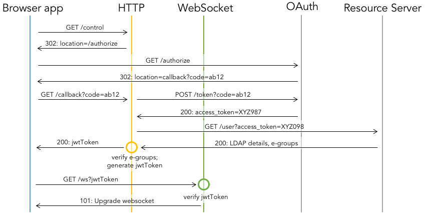
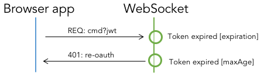

# Authentication and authorization flow
The full authorization and authentication flow is presented below.

## OAuth
Connecting users are authenticated (authorized in OAuth terminology) by OAuth service, which in the end of the process grants the web-application with [Access Token](https://auth0.com/docs/tokens/access-token). Access Token is used to retrieve the following user details from the Resource server:

 * ID
 * NICE login
 * name and surname
 * e-group membership

## Privileges
The e-group membership translates into list of privileges that user is granted within the web-application. For the time being only three privilege levels are defined:

 * spectator - previews changes made by other users
 * master - spectator + is allowed to execute commands
 * admin - master + manage connected users, force commands

## JSON Web Tokens
[JSON Web Tokens](https://jwt.io) allow secure information transport between entities and in this web-application is used as stateless sessions mechanism.
The user details provided by the Resource server and privilege level are encoded into the token using RSA. The token is shipped to Browser application. Each request coming from the Browser application (either to HTTP or WebSocket modules) must contain the token. The token is verified (simply by decryption) and the user details are available to processing request module.

# Token refresh scenarios
Each JSON Web Token has its expiration time. When token is expired it can no longer be used and must be refreshed.

## Successful
In case the token is expired it is verified once again based on *maxAge* parameter (expiration check is suppressed). The *maxAge* parameter >> *expiration*. If the verification is successful the new token (with the same user details) is created and transfered to Browser application.

## Unsuccessful
If the token is older than indicated by *maxAge* the user is forced to re-login.

