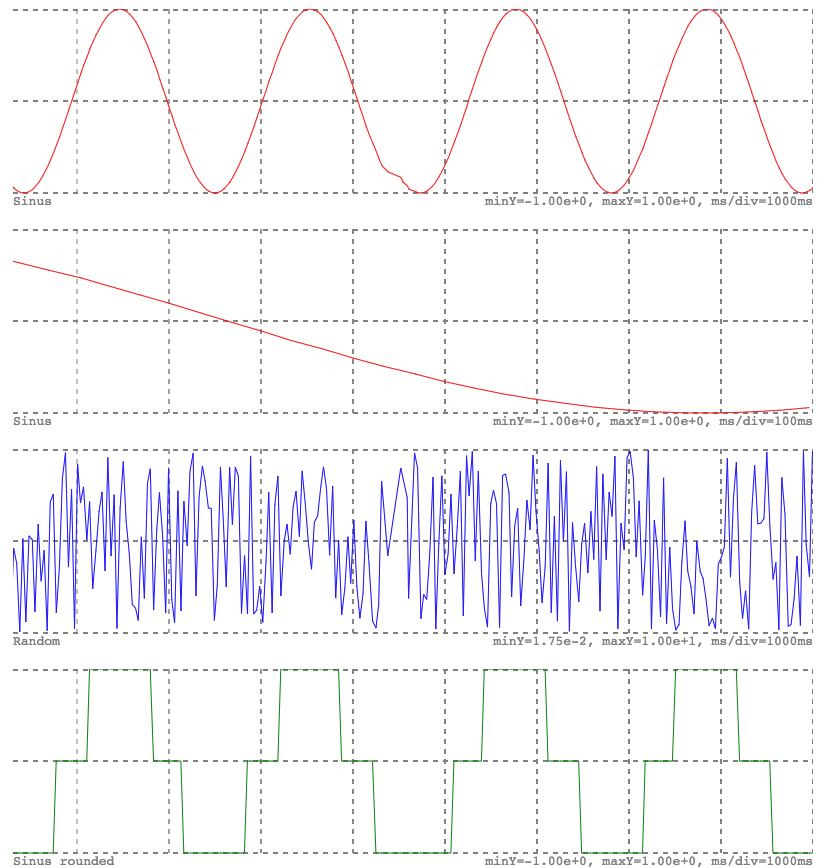

# Frontend - Charts

The frontend allows plotting time series. See how to works in a [JSFiddle demo](http://jsfiddle.net/awegrzyn/mjyzcen9/).
Full API is available in the [Frontend reference](../reference/frontend-api.md#chartTimeSerie).

## Usage

Each chart consits of a name, array of timestamp-value paris and a time scaling factor what eases zooming in or out.

- X axis is time based, "now" is defined as the border right, only recent data will be plot, older ones will be out of scope.
- Y axis has a dynamic range between minimal and maximal values.

```js
import {h, chartTimeSerie} from '../../Frontend/js/src/index.js';

h('div.m4', [
  chartTimeSerie({
    serie: [{value: 10, timestamp: Date.now()}, ...],
    title: 'Temperature',
    colorPrimary: 'red',
    width: '800',
  }),
]),
```



## Performance

Drawing is optimized for intensive use, example above shows updating 4 plots of 265 points each is rendered at 100 FPS on a 2015 Intel i5 laptop (60 FPS is considered fluid).

Recommandations:
- Keep page drawing time under 15ms (60 FPS)
- Draw only what will be seen by user, use tabs if needed
- Reduce number of points to draw, only first values of array will be drawn depending of scale, width and density

Performance factors:
- scale is defined by `timeScale` in ms
- width is defined by `width` in pixel
- density is defined by `serie` array and how many values per time range
