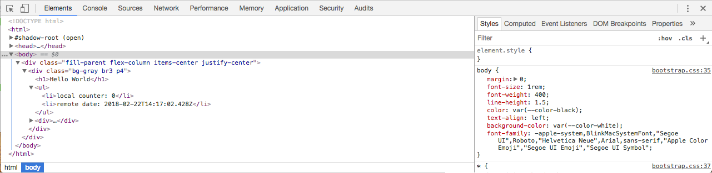

# Frontend - Debugging with the browser's inspector

In the web development, the inspector is the right debugging tool. It exists in the all of modern browsers.

The two most useful tabs are *Console* and *Network* (the naming depends on your browser).
The former allows communication with the Javascript engine, for example to manipulate variables or functions. The latter allows to track network activity: loaded files, server requests, WebSocket connection, etc.

In case of an error during script execution all details are shown in the *Console*. You can click on the error to display source code line which is associated with the error. You can also display  *Source code* tab by inserting `debugger;` keyword inside your source code.

Finally, *Element* or *DOM* tab shows the DOM tree of the current page. This is the output of the view (written in hyperscript). You can change values and see the result in real time.

## Documentation over different vendors
 + Safari- [Web Inspector](https://support.apple.com/fr-ch/guide/safari/use-the-safari-develop-menu-sfri20948/mac)
 + Firefox - [Inspector](https://developer.mozilla.org/en-US/docs/Tools/Page_Inspector)
 + Chrome - [Developer Tools](https://developer.chrome.com/devtools)
