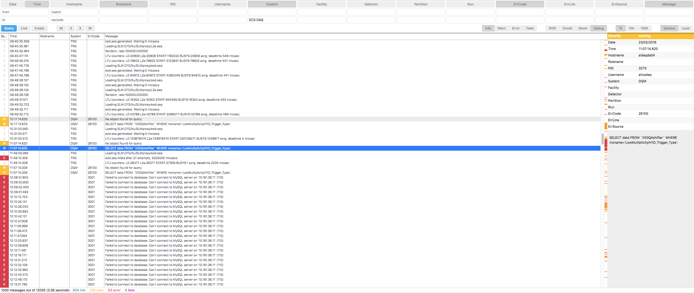

# InfoLoggerGui

Web app for querying infoLogger database and streaming logs in real-time with filtering. Compatible with all browsers, starting from IE 12 (Edge).

User documentation:
 * [Configuration (config.js, oauth and certificate)](docs/configuration.md)
 * [Install or remove package](docs/create-install-remove-package.md)

Dev documentation:
 * [Development guide - getting started](docs/developement-guide.md)
 * [Configuration (config.js, oauth and certificate)](docs/configuration.md)
 * [Create a package release](docs/create-install-remove-package.md)
 * [API](docs/API.md)

### Credits

Favicon made by Freepik from www.flaticon.com

