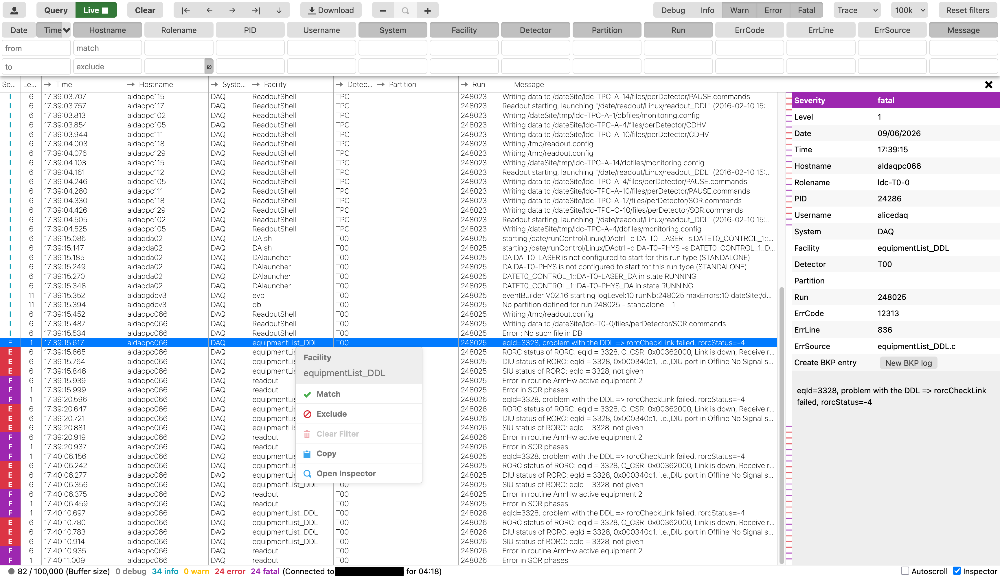

# InfoLogger GUI (ILG)

[](https://github.com/AliceO2Group/WebUi/actions)
[](https://codecov.io/gh/AliceO2Group/WebUi)

- [InfoLogger GUI (ILG)](#infologger-gui-ilg)
  - [Interface User Guide](#interface-user-guide)
  - [Requirements](#requirements)
  - [Installation](#installation)
  - [Dummy InfoLogger test server](#dummy-infologger-test-server)
  - [InfoLogger insights](#infologger-insights)
  - [Continuous Integration Workflows](#continuous-integration-workflows)
    - [infologger.yml](#infologgeryml)
    - [release.yml](#releaseyml)

Web user interface of [InfoLogger](https://github.com/AliceO2Group/InfoLogger) logging system. 

It interfaces with the system using two modes:

- **Query**: Querying historical logs from a database
- **Live**: Receiving Real-Time logs from a TCP endpoint over InfoLogger protocol (v1.3, v1.4)



## Interface User Guide
- Use upper panel to:
  - match and/or exclude filters (Supports SQL Wildcard `%`)
  - limit the number of logs displayed
  - match severity and level
  - reset the filters
- Show/hide columns by clicking on labels on top of page
- Click "Query" or "Live" button to start the respective mode
- Double click on a log or toggle the inspector view from the bottom right corner to see all fields of the log
- Use arrows keys to navigate quickly between logs
- Download the logs in a file via the top left download icon

## Requirements
- `nodejs` >= `16.x`
- InfoLogger MariaDB database for Query mode
- InfoLoggerServer endpoint for Live mode

## Installation
1. `git clone https://github.com/AliceO2Group/WebUi.git; cd WebUi/InfoLogger`
2. `npm install --prod`
3. `cp config-default.js config.js`
4. Modify `config.js` file to set InfoLogger database and endpoint details
5. Start web app: `npm start`
6. Open browser and navigate to http://localhost:8080

## Development database installation
In order to run queries in the InfoLogger a MariaDB server is required. To run a local MariaDB server that can easily be updated/wiped/configured you will need Docker installed.
1. Follow the instructions specific for you platform: [docker desktop install](https://www.docker.com/products/docker-desktop/)
2. Create a `compose.yaml` file somewhere on your pc with the following content: 
```
services:
  mariadb:
    image: mariadb
    restart: unless-stopped
    ports:
     - 3306:3306
    environment:
      MARIADB_ROOT_PASSWORD: root
    # (this is just an example, not intended to be a production configuration)
  phpmyadmin:
    image: phpmyadmin
    restart: unless-stopped
    ports:
      - 9090:80
    environment:
      - PMA_HOST=mariadb
```
This will get you a MariaDB server with phpmyadmin.
Should you ever feel the need to test a specific version of MariaDB then change the image to `mariadb:11.5` where 11.5 is the version. By default the compose.yaml will get you the latest MariaDB image.

3. Execute the following command in the same directory as the compose.yaml file: `docker compose up -d` this will start the containers and the `-d` parameter makes sure you can close your commandline window by running in daemon mode.
4. You should now be able to visit `http://localhost:9090/` in your browser of choice, enter user and password root to login.
5. Create the `INFOLOGGER` database by clicking `New` in the phpMyAdmin UI on the left side.
6. In the phpMyAdmin UI select `SQL` on the top of the page. Then enter the contents of the `InfoLogger/docs/database-specs.sql` file in the field and pressing the `Go` button.
7. Edit `config.js` to point to your local database: 
```
mysql: {
  host: '127.0.0.1',
  user: 'root',
  password: 'root',
  database: 'INFOLOGGER',
  port: 3306,
  timeout: 60000,
  retryMs: 5000,
},
```
8. Run the InfoLogger and check for the following message in the console: `info: Connection to DB successfully established: 127.0.0.1:3306`

## Docker development

docker compose -f docker-compose.yaml -f docker-compose.dev.yml down -v
docker compose -f docker-compose.yaml -f docker-compose.dev.yml up -d --build

process.env.mariadb_host ?? '127.0.0.1'

## Dummy InfoLogger test server
InfoLoggerServer can be simulated by running `npm run simul`. The dummy server binds `localhost:6102` endpoint.
## InfoLogger insights
- [Message protocol](docs/il-protocol.md)
- [Database structure](docs/database-specs.sql)

## Continuous Integration Workflows
InfoLogger project makes use of two workflows.
### [infologger.yml](./../.github/workflows/infologger.yml)
* Checks that tests of the project are running successfully on two virtual machines:
  * `ubuntu`
  * `macOS`
* Make sure that the proposed changes are not reducing the current code-coverage percent
* Sends a code coverage report to [CodeCov](https://codecov.io/gh/AliceO2Group/WebUi)

### [release.yml](../.github/workflows/release.yml)
* Releases a new version of the project to the [NPM Registry](npmjs.com/) under the tag [@aliceo2/infologger](https://www.npmjs.com/package/@aliceo2/infologger)
* Builds a `tgz` file which contains an archive of the project. This can be used for local repositories installations.
