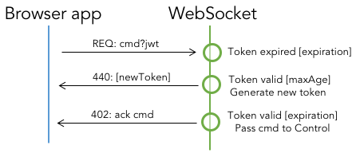

# Architecture
The functional architecture of the web-application is shown below.


The web-application requires presence of three external services:

 * OAuth - [OAuth 2.0](https://oauth.net/2/) service to authorize connecting users
 * Resource - resource server that provides user details (including additional authorization data - e-group membership) based on OAuth access token
 * O<sup>2</sup> Control Agent - the O<sup>2</sup> process that manages the Control subsystem

and it consists of three modules:

 * Browser app - the application running in user's browser, easily extensible via jQuery Widgets
 * HTTP server - takes part in [OAuth 2.0](https://oauth.net/2/) flow and provides REST API
 * WebSocket server - provides bi-directional connection between browser and the server via WebSocket protocol - [RFC 6455](https://tools.ietf.org/html/rfc6455). It's also entry point to O<sup>2</sup> Control subsystem via [ZeroMQ](http://zeromq.org/intro:read-the-manual) protocol


# Authentication and authorization flow
The full authorization and authentication flow is presented below.


## OAuth
Connecting users are authenticated (authorized in OAuth terminology) by OAuth service, which in the end of the process grants the web-application with [Access Token](https://auth0.com/docs/tokens/access-token). Access Token is used to retrieve the following user details from the Resource server:

 * ID
 * NICE login
 * name and surname
 * e-group membership

## Privileges
The e-group membership translates into list of privileges that user is granted within the web-application. For the time being only three privilege levels are defined:

 * spectator - previews changes made by other users
 * master - spectator + is allowed to execute commands
 * admin - master + manage connected users, force commands

## JSON Web Tokens
[JSON Web Tokens](https://jwt.io) allow secure information transport between entities and in this web-application is used as stateless sessions mechanism.
The user details provided by the Resource server and privilege level are encoded into the token using RSA. The token is shipped to Browser application. Each request coming from the Browser application (either to HTTP or WebSocket modules) must contain the token. The token is verified (simply by decryption) and the user details are available to processing request module.

# Token refresh scenarios
Each JSON Web Token has its expiration time. When token is expired it can no longer be used and must be refreshed.

## Successful
In case the token is expired it is verified once again based on *maxAge* parameter (expiration check is suppressed). The *maxAge* parameter >> *expiration*. If the verification is successful the new token (with the same user details) is created and transfered to Browser application.



## Unsuccessful
If the token is older than indicated by *maxAge* the user is forced to re-login.


# Web Push Notifications (VAPID)

Web Push Notifications are a modern way of notifying users. Web Push Notifications are subtle pop up messages to which users can subscribe.
The ['web-push'](https://github.com/web-push-libs/web-push) package is used to facilitate the process of sending notifications and also to handle legacy support for browsers relying on GCM for message sending / delivery.

## Service Workers

- Service Workers are background processes that run in a browser.
- Web Push Notifications use Service Workers at its core.
- Service Workers are responsible for receiving messages from the Cloud Server and displaying them as notifications.
- Service workers are lightweight processes and do not require significant processing resources.

## Components

  
  
- **‘web-push’ package**

  Node package to facilitate Push Notification Service.

<br><br>

  
- **Message Push Server**

  The server/machine which generates notification messages.

<br><br>

  
- **Control GUI Application Database**

  MySQL Database in Control GUI for storing subscription objects locally.

<br><br>

  
- **Client (Browser)**

  The browser in the device of subscribed user.

<br><br>

- **Subscription object**

  Is used to identify the subscribed clients using a dedicated endpoint.


- **VAPID Keys**

  Are used to identify the server from which push request is generated.

## Workflows

### Subscription Flow


- User clicks on the subscribe button
- The client browser sends a subscription request to the 'web-push' along with its VAPID Public Key
- The 'web-push' server subscribes the user, saves the Public Key of server to identify it later and sends back a subscription object
- This subscription object consists of 3 things-
  ```javascript
  "endpoint": "<URL>",
  "keys": {
    "p256dh": "<key>",
    "auth": "<key>"
  }
  ```
- The client browser receives this object and saves it to the local MySQL Database to use it later.

**_User is subscribed !_**

- - -

### Message Send Flow


- Message Push Server fetches the subscriptions saved in the local MySQL Database.
- The Message Push Server generates the message to be sent and passes a push request to the 'web-push' server along with the endpoint of the subscriber and its own VAPID Private Key.
- 'web-push' server verifies the VAPID Private Key received to identify the server which sent the push request.
- After successful verification, a Push Notification is sent to the Client Browser.
- The Client browser's Service Worker receives the Notification and displays it to the user.

**_Message is sent !_**

- - -

### Unsubscription Flow


- Client clicks the unsubscribe button
- An unsubscribe request is sent from client to 'web-push' server
- 'web-push' server deletes the user subscription and sends a confirmation back to the client
- Client sends an unsubscription request to local MySQL Database and the user subscription is deleted from there also.

**_User is unsubscribed !_**

- - -

## Browser Support

- Service Workers and thus, Push Notifications are currently supported in the latest versions of following browsers - 
  - Chrome
  - Firefox
  - Opera
- Safari doesn’t support Service Workers but Push Notifications can be sent using Apple Push Notifications Service (APNS).
