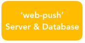
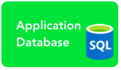
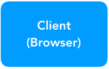
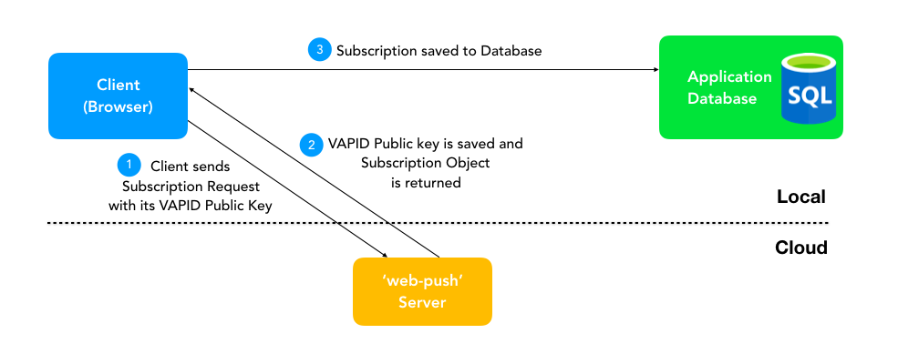
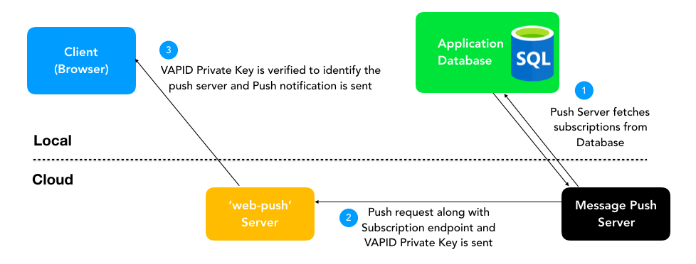
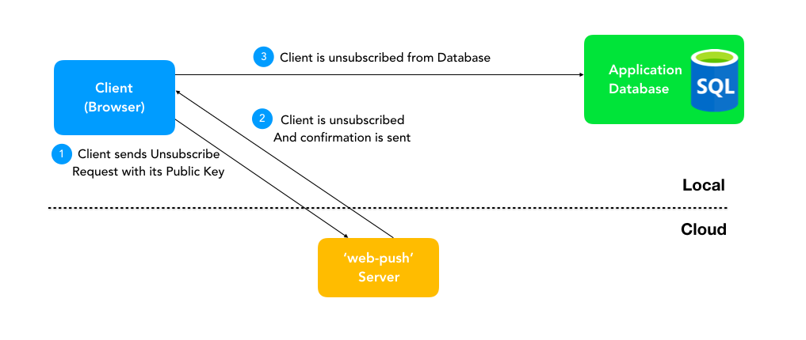

# Web Push Notifications

Web Push Notifications are a modern way of notifying users. Web Push Notifications are subtle pop up messages to which users can subscribe.
They are simple, effective, customisable, responsive.

# Contents
- [Overview](#overview)
- [Service Workers](#service-workers)
- [Components](#components)
- [Workflows](#workflows)
  - [Subscription Flow](#subscription-flow)
  - [Message Send Flow](#message-send-flow)
  - [Unsubscription Flow](#unsubscription-flow)
- [Browser Support](#browser-support)

## Overview

The ['web-push'](https://github.com/web-push-libs/web-push) package is used to facilitate the process of sending notifications and also to handle legacy support for browsers relying on GCM for message sending / delivery.

## Service Workers

- Service Workers are background processes that run in a browser.
- Web Push Notifications use Service Workers at its core.
- Service Workers are responsible for receiving messages from the Cloud Server and displaying them as notifications.
- Service workers are lightweight processes and do not require significant processing resources.

## Components

  
  
- **‘web-push’ package**

  Node package to facilitate Push Notification Service.

<br><br>

  
- **Message Push Server**

  The server/machine which generates notification messages.

<br><br>

  
- **Control GUI Application Database**

  MySQL Database in Control GUI for storing subscription objects locally.

<br><br>

  
- **Client (Browser)**

  The browser in the device of subscribed user.

<br><br>

- **Subscription object**

  Is used to identify the subscribed clients using a dedicated endpoint.


- **VAPID Keys**

  Are used to identify the server from which push request is generated.

## Workflows

### Subscription Flow


- User clicks on the subscribe button
- The client browser sends a subscription request to the 'web-push' along with its VAPID Public Key
- The 'web-push' server subscribes the user, saves the Public Key of server to identify it later and sends back a subscription object
- This subscription object consists of 3 things-
  ```javascript
  "endpoint": "<URL>",
  "keys": {
    "p256dh": "<key>",
    "auth": "<key>"
  }
  ```
- The client browser receives this object and saves it to the local MySQL Database to use it later.

**_User is subscribed !_**

- - -

### Message Send Flow


- Message Push Server fetches the subscriptions saved in the local MySQL Database.
- The Message Push Server generates the message to be sent and passes a push request to the 'web-push' server along with the endpoint of the subscriber and its own VAPID Private Key.
- 'web-push' server verifies the VAPID Private Key received to identify the server which sent the push request.
- After successful verification, a Push Notification is sent to the Client Browser.
- The Client browser's Service Worker receives the Notification and displays it to the user.

**_Message is sent !_**

- - -

### Unsubscription Flow


- Client clicks the unsubscribe button
- An unsubscribe request is sent from client to 'web-push' server
- 'web-push' server deletes the user subscription and sends a confirmation back to the client
- Client sends an unsubscription request to local MySQL Database and the user subscription is deleted from there also.

**_User is unsubscribed !_**

- - -

## Browser Support

- Service Workers and thus, Push Notifications are currently supported in the latest versions of following browsers - 
  - Chrome
  - Firefox
  - Opera
- Safari doesn’t support Service Workers but Push Notifications can be sent using Apple Push Notifications Service (APNS).