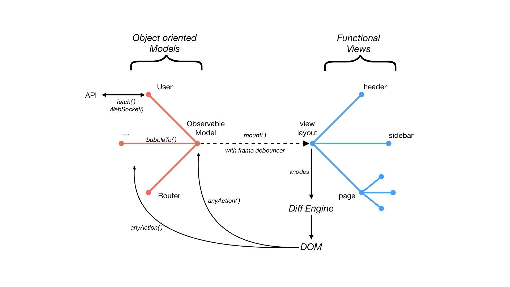

# Guide - How to scale and architecture

### Files

In the tutorials you can see a single model and a single view. But a large application cannot be made as a large file. A good way is to split the code into module like this:

```
- user (folder, camelCase)
  - User.js (model, PascalCase)
  - userList.js (view, camelCase)
  - userItem.js (view, camelCase)
  - userAvatar.js (view, camelCase)
  - user.css (facultative style, camelCase)
```

This allows you to have everything concerning a module in the same place. You can have as many modules as you want. At some point you can ever create a super-module as a folder for some parts of your application.

For common things like a `header.js` or `alert.js`, a `common` folder can be made.

### View

Inside the view files, avoid to have a big function containing all your page. Try to split in smaller functions and pass the model as parameter each time.

```js
export function userList(model) {
  return h('ul', model.user.list.map(user => userListRow(model, user)));
}

function userListRow(model, user) {
  return h('li', user.name);
}
```

### Model

The `Observable` model can be, like the view, a tree and all notification event can be bubbled to the root model like this:

```js
class Model extends Observable {
  constructor() {
    super();
    this.submodel = new SubModel();
    this.submodel.bubbleTo(this);
  }
}

class SubModel extends Observable {
  constructor() {
    super();
    this.count = 0;
  }

  increment() {
    this.count++;
    this.notify();
  }
}

const model = new Model();
```

When a call to `model.submodel.increment()` is made, `model` will be notified and will call all callbacks registered via `model.observe(callbackFunction)`.


