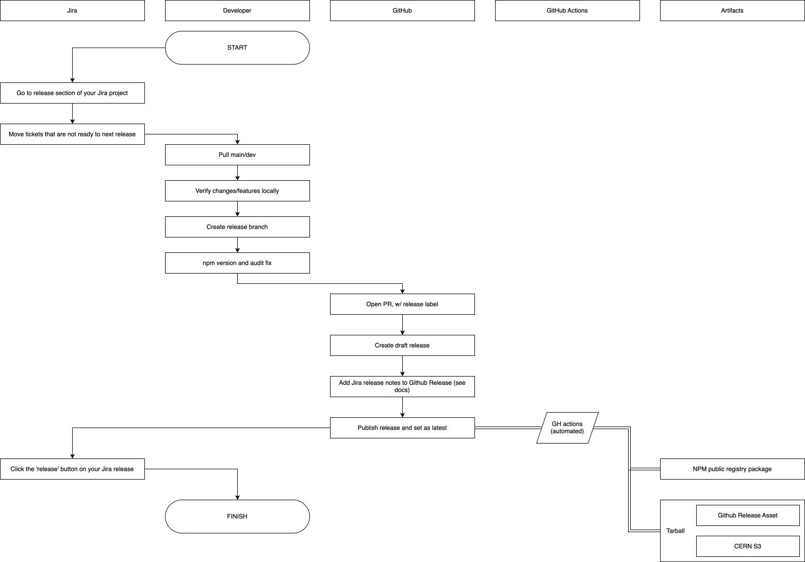
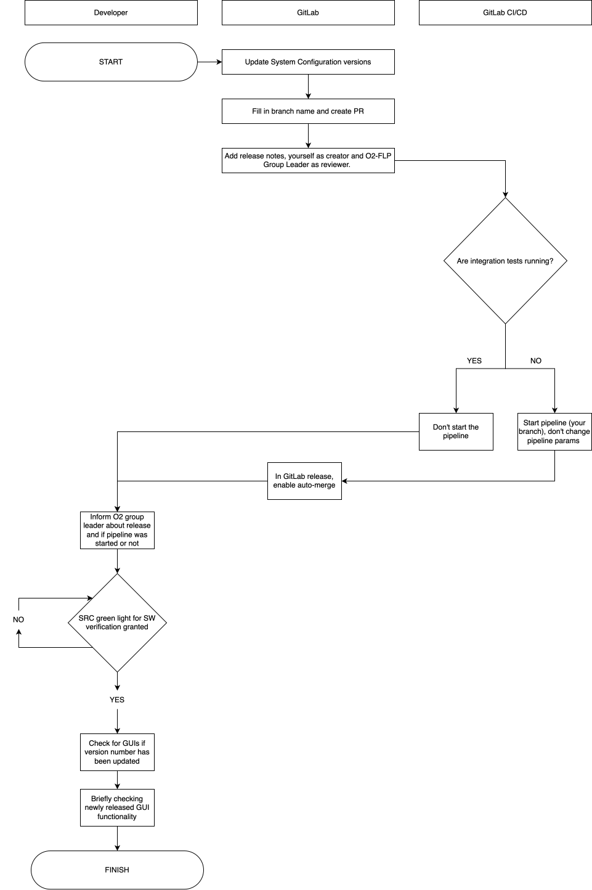

# Release and Deployment Guide

## Key

- `<prefix_gui>`: one of `bkp`, `qcg`, `cog`, `ilg`
- `<version>`: version number in the format `X.Y.Z` (e.g., `1.15.0`)
- `PR`: Pull Request
- `GH CLI`: GitHub Command Line Interface

## Release

### 1. Prepare the Jira Release

1. Go to Release section of your Jira project
2. Review all the tickets (on the "issues in version" tab) assigned to the release
3. Move any ticket not in "Ready for release" or "Closed" to the next release and update its `Fix Version` field. Use the bulk editor, accessible via the issue navigator, to do this efficiently.
4. Move leftover tickets from "Ready for release" to "Closed"
5. Add any parent tasks that have subtasks in the release but are not yet included

> [!TIP]
> When using the bulk editor, uncheck the option to send email notifications to avoid spamming team members with multiple emails about status changes.
> You can also use the bulk editor to change the `Status` field.
> You can also use the bulk editor to change the `Fix Version` field.

### 2. Validate the Release Locally

1. Checkout the default (`dev/main`) branch of the Github repository that contains the GUI application. Make sure to pull all latest changes
2. Verify that all changes related to the release tickets are present
3. Validate functionality:
   - No errors in the browser console
   - No errors in the server logs
   - All common use cases work as expected

### 3. Create Release Branch and PR

1. Create a release branch: `git checkout -b release/<prefix_gui>/<version>` (e.g., `release/bkp/1.15.0`)
2. Update the version number: `npm version patch/minor/major`
3. Check and fix known vulnerabilities: `npm audit fix`
4. Stage and commit the changes
5. Push the branch to the remote repository
6. Open a PR for the release branch, add the `release` label and assign the PR to yourself
7. Once tests have passed and one approval has been received, merge the PR

### 4. Create the GitHub Release

1. Draft a new GitHub release.
   - Title of the release must match exactly the Jira release name, (e.g., `@aliceo2/bookkeeping@1.15.0`, **NO WHITESPACE ALLOWED**)
   - Tag must be the same as the title
   - Target must be the default branch (e.g., `dev` or `main`)
2. Copy the html version of the release notes from Jira and edit them:
   - Remove the title
   - Replace H2 headings with H4
   - New features should always appear at the top
   - Group subtasks under their parent tasks (even if parent is not closed)
   - Developer text should be rewritten to user-friendly text
3. Set as latest release
4. Create the release

> [!CAUTION]
> Github workflow covers specific logic based on the release name.
> If name is wrong the Github action will fail. To fix this: delete the release AND the tag and start over.

### 5. GitHub Release Workflow (Automated apart from clicking "Create release" in Jira)

When you click "Create release" in Github, GitHub Actions will automatically:

1. Publish the NPM module to the ALICE O2 NPM registry. This is for people installing outside of CERN
2. Install production dependencies and publish the dedicated CERN release to our private CERN NPM registry called s3 (cern.s3.registry - linux training section)
3. Create the Tarball with `NPM pack` and attach it to the GitHub release's assets via the GH CLI. (This can be used to manually install the release if needed)
4. If at this point all GitHub Actions are green the release is done, the GitHub release package is created
5. Click "Release" in Jira to finalise the release, use today's date and click confirm.

### Release Diagram

---

## Deployment

### 1. Update System Configuration and Create PR

1. To deploy a release the version number/s must be changed in [system configuration repository](https://gitlab.cern.ch/AliceO2Group/system-configuration/-/blob/dev/ansible/roles/basevars/vars/main.yml?ref_type=heads)
2. Commit and create a new branch with name `gui-<prefix_gui>-<version>` **NO SLASH** in name allowed for the branch name as it will cause the flp-setup-tool to fail
3. Create the PR titled `[gui/<prefix_gui>/<version>]` (e.g., `[gui/bkp/cog/1.15.0]`)
4. Copy the release notes html from the GitHub release into the PR, add yourself as the creator and O2-FLP Group Leader as reviewer
5. Check if any existing pipelines are already running (`Build` tab then `Pipelines` in GitLab):
   1. If there ARE, do not start a pipeline and trust that the O2-FLP group leader will take care of the train of PRs
   2. If there ARE NOT then start the default pipeline FOR YOUR BRANCH, wait for the page to fully load and you don't need to change any pipeline parameters. Go back to the Gitlab release PR and set it to auto-merge for when pipeline will be successful
   3. Alert the O2-FLP group leader that release has been done and whether or not a new pipeline was started and if auto-merge is set
6. Once the release PR is merged there is nothing else left to be done and when there is a slot free the deployment will happen

### 2. Post-Deployment Verification

1. Once the SRC (Software Release Coordinator) of FLP gives the green light for software verification, ensure the GUI in specified environment runs as expected by:
   1. Checking the GUI version has been updated
   2. Briefly testing that the changes are working as expected

### Deployment Diagram

